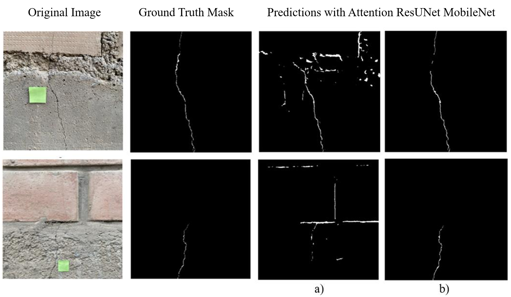
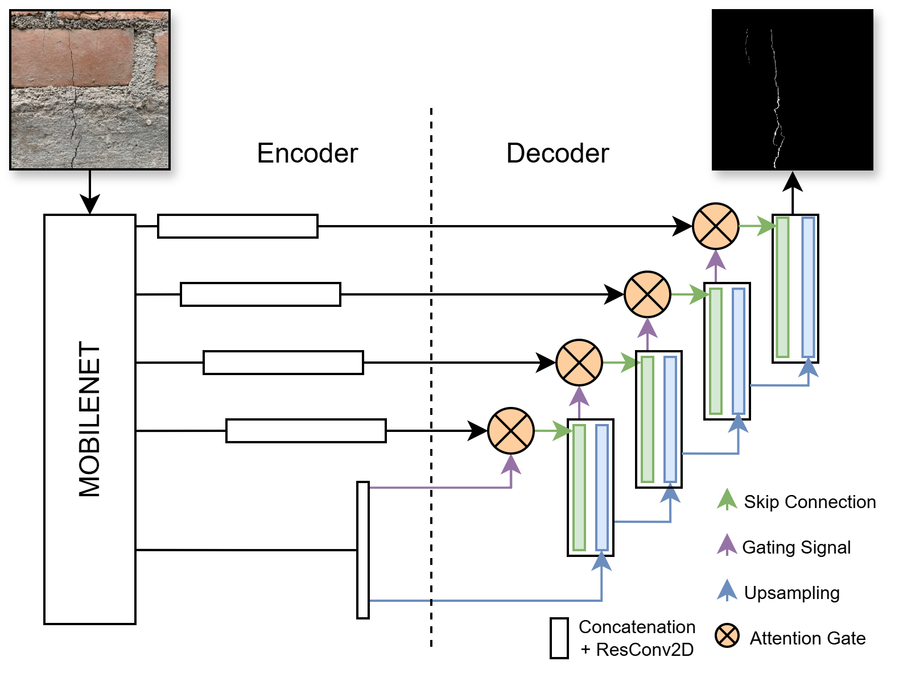
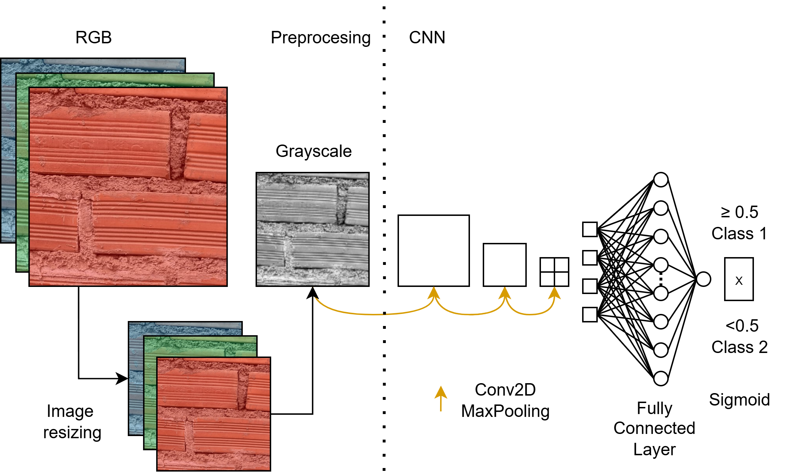

# Codes_Masonry
This repository contains the main codes used for crack semantic segmentation, brick type classification, and detection of spalling regions.

## Table of Contents
- [Description](#description)
- [Models](#models)
- [How to Run the Models](#how-to-run-the-models)
- [Dataset](#dataset)
- [References](#references)

## Description
This repository contains the main architectures developed for multiple computer vision tasks, including scale frame detection using HSV filters, semantic segmentation, skeletonization, brick type classification, and spalling region detection. It also includes the original dataset used for training and evaluation.

## Models
The proposed model for the crack semantic segmentation task is based on the UNet MobileNet architecture. Attention modules and residual blocks were incorporated as enhancements, along with a reduction in the number of parameters and an input adaptation for 512×512 pixel images. This results in the model we call Attention Res UNet MobileNet.

In addition, the proposed algorithm for brick classification consists of two stages. The first involves preprocessing the 512×512 image before feeding it into the CNN model, which corresponds to the second stage.

## How to Run the Models
...

## Dataset
...

## References
...
